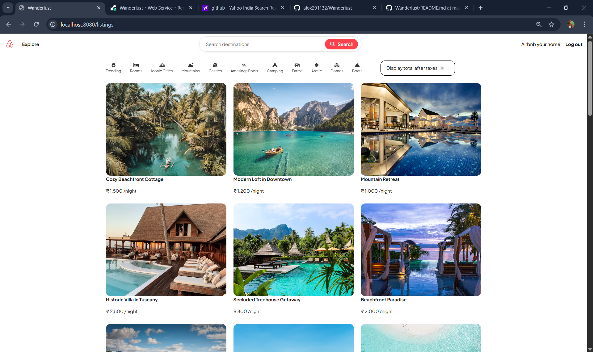
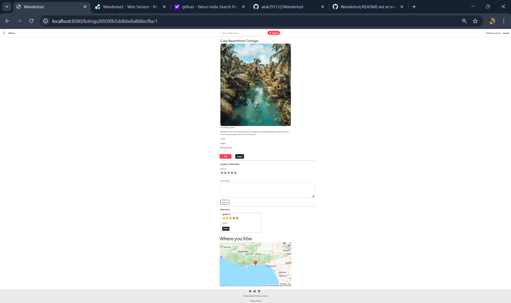

# 🏡 Wanderlust — Travel Listing Web App

*Live Demo:* [https://wanderlust-xmg5.onrender.com/listings](https://wanderlust-4g2n.onrender.com/listings)

Wanderlust is a full-stack web application  — allowing users to *list properties (homes, villas, or apartments), **browse stays, and **share reviews*.  
It’s built with the goal of creating a simple, clean, and extensible travel-stay platform where new features like *hotel booking, maps integration, and payment systems* can easily be added in the future.

---

## 🧭 Table of Contents

- [Overview](#overview)
- [Demo](#-demo)
- [Features](#features)
- [Tech Stack](#tech-stack)
- [Installation](#installation)
- [Environment Variables](#environment-variables)
- [Usage](#usage)
- [Future Improvements](#future-improvements)
- [Contributing](#contributing)
- [License](#license)
- [What I Learned](#What-I-Learned)
- [Author](#author)

---

## 📖 Overview

Wanderlust is designed for *property owners and travelers*.  
Owners can list their homes with descriptions and images, while users can explore stays, view property details, and leave reviews.  

It aims to provide a smooth browsing experience , with a modern and responsive UI.

---

## 🎥 Demo

### 🏡 Homepage

### 🏠 Listing Details

## ✨ Features

- 🏠 *Add / Edit / Delete Listings* — Property owners can manage their listings easily.  
- 🔍 *Search & Filter* — Users can search listings by title, location, or price (optional).  
- 💬 *Review System* — Users can post and delete reviews for listings.  
- 🧑‍💻 *User Authentication* — Secure login, registration, and session management.  
- 📸 *Image Upload* — Upload property images (Cloudinary / local).  
- 📱 *Responsive Design* — Works across desktop and mobile.  
- ⚙ *Error Handling & Validation* — Clean error pages and validation for forms.  
- 🗺 *Future Expansion:* Add hotel booking, Google Maps, and payment gateway integration.

---

## 🧰 Tech Stack

| Layer | Technology |
|-------|-------------|
| *Frontend* | EJS (Embedded JavaScript Templates), HTML5, CSS3, Bootstrap |
| *Backend* | Node.js, Express.js |
| *Database* | MongoDB (via Mongoose) |
| *Authentication* | Passport.js (Local Strategy) |
| *Image Storage* | Cloudinary (or local uploads) |
| *Deployment* | Render (Backend + MongoDB Atlas) |

---
## ⚙ Installation

- Clone the repository and install dependencies
- git clone https://github.com/alok291132/Wanderlust
- cd wanderlust
- npm install

---

## 🔐 Environment Variables

- CLOUD_NAME=yourCloudName
- CLOUD_API_KEY=yOUR_Cloud_API_KEY
- CLOUD_API_SECRET=Your_Api_Secret_key
- GOOGLE_MAP_TOKEN=Your_Google_Map_Token
- ATLAS_DB_URL=mongoDBURl
- SECRET=YourSecretKey

---

## 🚀 Usage

- Node app.js
- Open http://localhost:8080/listings

---  

## 🏗 Future Improvements

- [ ] 🏨 Hotel booking with availability calendar (High Priority)
- [ ] 💳 Stripe/Razorpay payment integration (Medium Priority)
- [ ] 🗺 Google Maps location previews (High Priority)
- [ ] 📧 Email notifications (Medium Priority)
- [ ] 🌙 Dark mode and multi-language support (Low Priority)

---

## 🤝 Contributing

- Contributions are always welcome!
- Fork the repository
- Create a new branch (feature/your-feature)
- Commit your changes
- Push to your branch and open a Pull Request

---

## 🪪 License

- You are free to use, modify, and distribute this project for learning or personal purposes.

---

## 📚 What I Learned
- Implementing CRUD operations using Express and Mongoose.
- Managing authentication and authorization using Passport.js.
- Handling file uploads via Cloudinary API.
- Structuring scalable MVC applications.
- Deploying Node.js apps using Render and MongoDB Atlas.

---

## 👨‍💻 Author

*Aditya Chaudhary*                                                                                                      
 BN College Of Engineering And Technology Lucknow– CSE (AI & ML)

   - 📧 Email: [av388428@gmail.com](mailto:adityanshu45@gmail.com)  
   - 🌐 GitHub: [alok291132](https://github.com/Adityanshu45)  
   - 🚀 Live Project: [https://wanderlust-xmg5.onrender.com/listings](https://wanderlust-4g2n.onrender.com/listings)